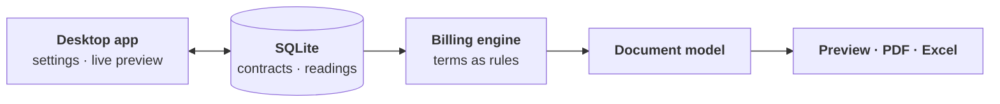

## Results

- 168 of 197 accounts automated; the other 29 need client-specific formats
- Preparation time: 15 → 5 minutes per account (−67%), about 20 hours saved per month
- 312 automated tests; an independent calculation matched all 1,501 customer-month cases
- Zero change in billed totals after the database redesign, checked against every past billing month
- Fixed a bug that could erase other months' settings before any data was lost; cross-agent review caught what a single audit missed
- Used for June–August billing and handed over to 2 trained users

## How the Application Works

## Screens

Shown with ColorInfoTech's permission. Fictional data and masked company details; English labels added for this page.

  <figure>
    
    <figcaption>Issuance editor: contract settings on the left, live statement preview on the right.</figcaption>
  </figure>
  <figure>
    
    <figcaption>Per-device pricing: base fee, included pages, and excess rate for each counter.</figcaption>
  </figure>
  <figure>
    
    <figcaption>Shared allowance across two devices: excess usage is billed once, in the aggregate block.</figcaption>
  </figure>
  <figure>
    
    <figcaption>Generated monthly statement for a fictional client.</figcaption>
  </figure>
  <figure>
    
    <figcaption>Client list with the latest meter reading month.</figcaption>
  </figure>

