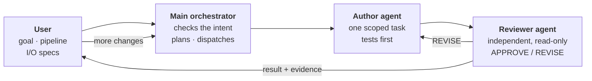

## How a Task Flows

## Intent Before Action

Inspired by the XY problem: people often ask AI for the fix they have in mind (Y) instead of the goal behind it (X).

- **Classify first:** Every turn opens with one line of detected intent (research, answer only, implement, or reconcile); an answer-only request never turns into code changes.
- **Context, then questions:** When the user points at files or past projects, the agent reads them first, then asks only the questions that pin down the goal.
- **Decisions as options:** Design questions come as short prose with A/B/C options and a recommendation, so one line answers them.

## Quality Gates

- **Evidence before “done”:** Run the command that proves the result, then report; the reviewer checks the actual changes.
- **Behavior preservation:** Save a baseline before a refactor and explain every difference after it.
- **Circuit breaker:** After three failed fixes, stop and rethink the approach.

## What Is Inside

| Part | What it does |
|---|---|
| Operating protocol | Always-on rules: delegate production code, verify before claiming done, and record the user's approval before any commit or push |
| 4 agents | **author** implements one scoped change; **reviewer** gives an independent, read-only verdict; **explorer** maps a codebase without editing; **researcher** gathers external evidence pinned to specific commits |
| 12 skills | On-demand procedures, such as brainstorming → plan document → step-by-step execution, author/reviewer review rounds, systematic debugging, and session handoff |
| 3 hooks | At session start, inject the protocol. On every prompt, add a short reminder and point to the right skill (English and Korean keywords). At stop, block once if a written plan has stalled |

Credits: some skills adapt ideas from [superpowers](https://github.com/obra/superpowers) (MIT) and [oh-my-openagent](https://github.com/code-yeongyu/oh-my-openagent); `ast-grep` and `insane-search` are vendored from [code-yeongyu/ast-grep-skill](https://github.com/code-yeongyu/ast-grep-skill) and [fivetaku/insane-search](https://github.com/fivetaku/insane-search) (MIT, licenses included).
{: .project-note}
