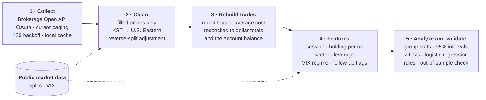

## How the Pipeline Works

## Results: Before and After the Rules

  <figure>
    
    <figcaption>After the rules, the win rate rose from 50% to 56% and the average losing trade shrank from −6.6% to −3.7%.</figcaption>
  </figure>
  <figure>
    
    <figcaption>Rolling win rate over the last 60 trades, which stayed above the 52% all-trade average for most of the period after the rules were adopted.</figcaption>
  </figure>

## Hypotheses and Method

| Hypothesis | How it was tested | Result |
|---|---|---|
| Pre-market entries underperform | Win rate by entry session (U.S. Eastern) | Confirmed: 35% vs. 52% for all trades (p < 0.01) |
| Losing positions are held too long | Win rate and return by holding period; average hold of winners vs. losers | Confirmed: 36% win rate past 10 days (p = 0.02); losers held 3.8 days vs. 3.0 for winners |
| Reacting to a loss (re-entering, adding, flipping direction) hurts results | Follow-up trades flagged and compared with first entries | Partly: follow-ups won more often (53–57% vs. 51%) but earned less per trade, so the first entry was the weak point |
| High volatility hurts results | Win rate and return by VIX close on the entry date | Partly: no effect on the win rate (odds ratio 1.05), while the average return fell from +2.6% to +0.1% as the VIX rose |

- **Unit of analysis:** a round trip (entry to exit), built with average-cost matching and reconciled to each symbol's dollar P&L. A win is a round trip with positive P&L after fees; the return is P&L over the entry cost. The ~1,200 orders pair into 558 round trips, which the charts count as trades.
- **Follow-up flags:** a re-entry within 60 minutes of a losing exit; a buy below the position's running average cost; an opposite-direction entry on the same underlying within 3 days of an exit.
- **Market context:** entry times mapped to U.S. Eastern sessions; the VIX regime comes from the public daily close (calm below 16, normal 16–22, elevated above 22).
- **Statistics:** 95% confidence intervals on win rates, two-proportion z-tests, and a logistic regression with sector controls.
- **Out-of-sample check:** the rules were found on trades before adoption and checked only on trades after it.
- **Guardrails:** breakdowns with too few trades are left out of the charts.

## What the Data Showed

  <figure>
    
    <figcaption>Pre-market entries won 35% of the time, against 52% for all trades.</figcaption>
  </figure>
  <figure>
    
    <figcaption>Positions held over 10 days had the lowest win rate, which led to the time-based exit rule.</figcaption>
  </figure>
  <figure>
    
    <figcaption>Crypto-linked and biotech trades won least often (38% and 32%), the only sectors clearly below the 52% average.</figcaption>
  </figure>
  <figure>
    
    <figcaption>With sector and the other factors held constant, pre-market entries and long holds each cut the odds of a win by more than half; follow-up trades and a high VIX had no significant effect.</figcaption>
  </figure>

## Getting the P&L Right

Share-count matching broke on reverse splits that the broker and the data vendor booked on different days, flipping the sign of P&L. I caught it against the account balance and moved the pipeline to dollar-based P&L.

  <figure>
    
    <figcaption>Illustrative example of the split problem and the dollar-based fix.</figcaption>
  </figure>

Not investment advice.

